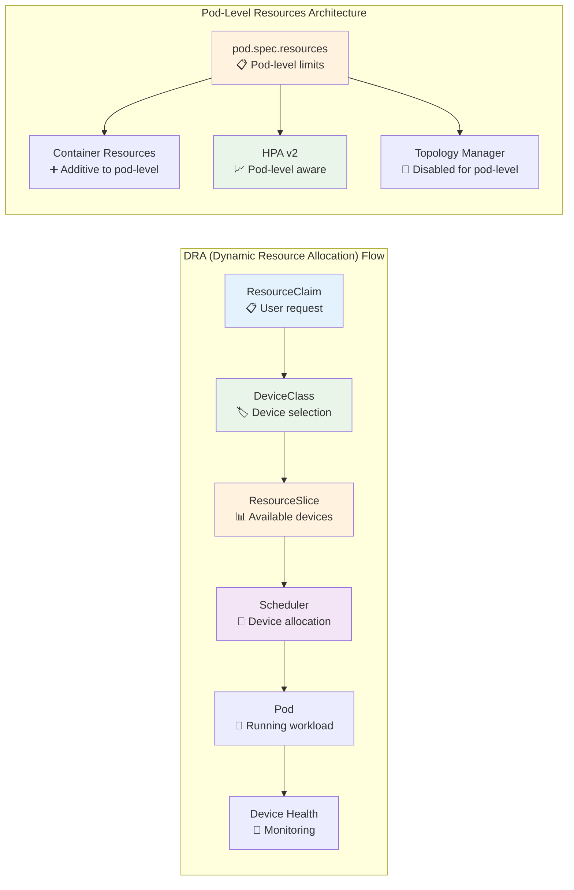
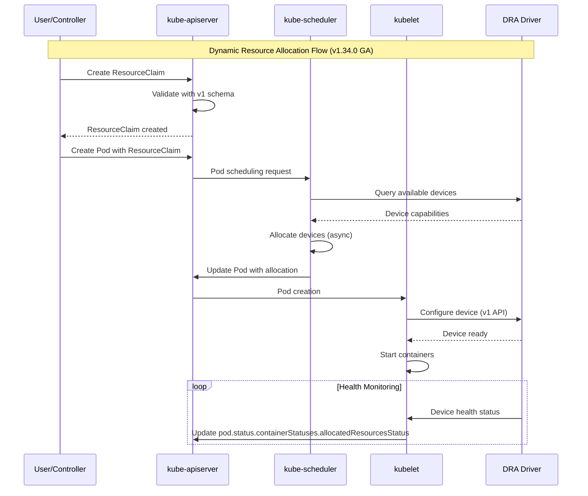

```mermaid
graph TB
    subgraph "Kubernetes v1.34.0 Architecture Overview"
        subgraph "Control Plane"
            API[kube-apiserver<br/>✨ APIServerTracing GA<br/>🔧 Async API calls<br/>📊 New metrics]
            ETCD[etcd v3.6.4<br/>🔄 Compaction improvements]
            SCHED[kube-scheduler<br/>🚀 Async API calls<br/>🎯 DRA GA<br/>📈 Performance metrics]
            CM[kube-controller-manager<br/>🔄 ResourceClaim controller<br/>📊 Enhanced metrics]
        end
        
        subgraph "Node Components"
            KUBELET[kubelet<br/>🏷️ Pod-level resources (Beta)<br/>🔧 DRA device health<br/>📝 Observed generation tracking]
            PROXY[kube-proxy<br/>🪟 WinDSR & WinOverlay GA<br/>🌐 EndpointSlice based]
            CRI[Container Runtime<br/>🔄 Service account credentials<br/>📦 Protocol buffer migration]
        end
        
        subgraph "Storage & Resources"
            CSI[CSI Drivers<br/>🚨 Attachment limit detection<br/>🔄 Volume expansion recovery GA]
            DRA_DRIVER[DRA Drivers<br/>✅ v1 API (GA)<br/>🏥 Health monitoring<br/>📊 Resource tracking]
            PV[Persistent Volumes<br/>🏷️ VolumeAttributesClass GA<br/>🔧 Dynamic attribute updates]
        end
        
        subgraph "New Features & Enhancements"
            POD_LEVEL[Pod-Level Resources<br/>📋 pod.spec.resources<br/>🎯 HPA support<br/>🔧 Topology manager integration]
            SECURITY[Enhanced Security<br/>🔐 Service account validation<br/>🛡️ AppArmor SecurityContext<br/>📝 Certificate request validation]
            OBSERVABILITY[Enhanced Observability<br/>📊 New metrics collection<br/>🔍 Tracing improvements<br/>📈 Memory tracking]
        end
    end
    
    API --> SCHED
    API --> CM
    API --> ETCD
    KUBELET --> API
    KUBELET --> CRI
    KUBELET --> DRA_DRIVER
    PROXY --> API
    CSI --> KUBELET
    DRA_DRIVER --> SCHED
    
    style API fill:#e1f5fe
    style SCHED fill:#f3e5f5
    style DRA_DRIVER fill:#e8f5e8
    style POD_LEVEL fill:#fff3e0
    style SECURITY fill:#ffebee
    style OBSERVABILITY fill:#f1f8e9
```



