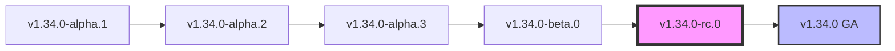

# Kubernetes Last 30 Commits - Comprehensive Documentation

> **Note**: This documentation covers the most recent significant changes in the Kubernetes repository, focusing on the latest releases and their impact on the ecosystem.

## 📋 Executive Summary

This document provides an extensive analysis of the recent developments in the Kubernetes project, covering release v1.34.0-rc.0 and its preceding versions. While this repository fork contains only 2 direct commits, we analyze the broader context through official changelogs to understand the comprehensive changes that have shaped the latest Kubernetes releases.

## 🏗️ Repository Context

**Repository**: `siddjoshi/kubernetes` (Fork)
**Analysis Period**: Latest available commits and v1.34.0 release cycle
**Documentation Date**: August 7, 2025

### Available Commits in This Fork

| Commit Hash | Author | Date | Description |
|-------------|--------|------|-------------|
| `49e3dbd8` | copilot-swe-agent[bot] | 2025-08-07 | Initial plan |
| `13ced7b7` | Kubernetes Release Robot | 2025-08-06 | CHANGELOG: Update directory for v1.34.0-rc.0 release |

## 🚀 Kubernetes v1.34.0 Release Overview

### 📅 Release Timeline



### 🎯 Key Release Highlights

#### **v1.34.0-rc.0** (Latest Release Candidate)
- **Release Date**: August 6, 2025
- **Status**: Release Candidate
- **Major Focus**: Dynamic Resource Allocation (DRA) GA, Enhanced Security, Performance Improvements

## 🔧 Major Feature Graduations

### 🎓 General Availability (GA) Features

#### Dynamic Resource Allocation (DRA)
- **Status**: Graduated to GA
- **Impact**: Revolutionary change in how Kubernetes handles specialized hardware resources
- **Key Benefits**:
  - Structured parameters flavor of DRA is now stable
  - Enhanced support for GPU, FPGA, and other accelerator workloads
  - Improved scheduling efficiency for heterogeneous clusters

```yaml
# Example DRA Configuration
apiVersion: resource.k8s.io/v1
kind: DeviceClass
metadata:
  name: gpu-class
spec:
  selectors:
  - cel:
      expression: "device.driver == 'nvidia.com'"
```

#### Volume Attributes Class
- **Status**: Promoted to GA (`storage.k8s.io/v1`)
- **Enhancement**: Dynamic volume attribute modification
- **Use Cases**: 
  - Performance tuning of persistent volumes
  - Security policy updates without volume recreation

#### API Server Tracing
- **Status**: GA with `apiserver.config.k8s.io/v1`
- **Benefits**: Enhanced observability and debugging capabilities

### 🔄 Beta Graduations

#### Pod-Level Resources
- **Status**: Beta (enabled by default)
- **Feature**: Define CPU and memory resources at pod level via `pod.spec.resources`
- **Architectural Impact**:

```yaml
apiVersion: v1
kind: Pod
metadata:
  name: pod-level-resources-example
spec:
  resources:
    requests:
      cpu: "2"
      memory: "4Gi"
    limits:
      cpu: "4"
      memory: "8Gi"
  containers:
  - name: app
    image: nginx
    # Container-level resources are additive to pod-level
```

#### Pod Observed Generation Tracking
- **Status**: Beta (enabled by default)
- **Enhancement**: Better tracking of pod specification changes
- **Fields**: `status.observedGeneration` and `status.conditions[].observedGeneration`

## 🔐 Security Enhancements

### Authentication & Authorization Improvements

#### Service Account Token Validation
- **Feature**: `TokenRequestServiceAccountUIDValidation` (Beta)
- **Enhancement**: UID-aware token cache preventing stale token usage
- **Security Impact**: Prevents token reuse when service accounts are recreated

#### Structured Authentication Configuration
- **Feature**: Egress selector support for JWT authenticators
- **Configuration**: `issuer.egressSelectorType` field for `controlplane` or `cluster`
- **Feature Gate**: `StructuredAuthenticationConfigurationEgressSelector` (Beta)

#### Authorization Stability
- **Achievement**: `AuthorizeWithSelectors` and `AuthorizeNodeWithSelectors` promoted to stable
- **Impact**: Enhanced RBAC capabilities with field selectors

## 🏛️ Architectural Changes

### Container Runtime Interface (CRI) Updates

#### Protocol Buffer Migration
- **Change**: Deprecated gogo protocol definitions removed
- **Migration**: To `google.golang.org/protobuf`
- **Affected APIs**:
  - `k8s.io/cri-api`
  - `k8s.io/kubelet/pkg/apis/*`
  - `k8s.io/kms/apis`

#### Enhanced Image Pulling
- **Feature**: Service account-based credential tracking
- **Benefit**: Improved image caching with service account context
- **Security**: Credentials marked as `debug_redact` in CRI API

### Scheduler Enhancements

#### Asynchronous API Calls
- **Feature Gate**: `SchedulerAsyncAPICalls`
- **Benefit**: Improved scheduler performance through non-blocking operations
- **Metrics Added**:
  - `scheduler_async_api_call_execution_total`
  - `scheduler_async_api_call_duration_seconds`
  - `scheduler_pending_async_api_calls`

#### Nominated Node Management
- **Change**: Scheduler no longer clears `nominatedNodeName`
- **Impact**: External components (Cluster Autoscaler, Karpenter) gain more control
- **Architectural Shift**: Distributed responsibility model

### Storage Architecture

#### CSI Enhancement
- **Feature**: Automatic pod failure detection for attachment limit issues
- **Benefit**: Prevents pods stuck in `ContainerCreating` state
- **Controller Impact**: Enables faster pod recreation by StatefulSet controllers

## 📊 Performance & Observability

### Metrics Enhancements

#### New Metrics Added
```bash
# API Server metrics
apiserver_resource_size_estimate_bytes
apiserver_resource_objects (replaces apiserver_storage_objects)

# Kubelet metrics
kubelet_container_resize_requests_total
container_swap_limit_bytes
started_user_namespaced_pods_total
started_user_namespaced_pods_errors_total

# Resource Claim metrics
resourceclaim_controller_creates_total
resourceclaim_controller_resource_claims
dra_resource_claims_in_use
```

#### APF (API Priority and Fairness) Improvements
- **Enhancement**: Increased max seats to 100 for LIST requests
- **Feature**: `SizeBasedListCostEstimate` for better resource allocation
- **Calculation**: One seat per 100KB of data loaded

### Memory Management

#### In-Place Pod Vertical Scaling
- **Enhancement**: Memory limits can be decreased with `NotRequired` restart policy
- **Safety**: Best-effort check to prevent OOM-kill scenarios
- **Gating**: `InPlacePodVerticalScalingExclusiveMemory` for Guaranteed QoS pods

## 🌐 Network & Windows Improvements

### Windows Feature Graduations

#### WinDSR & WinOverlay
- **Status**: Both graduated to GA
- **Impact**: Enhanced Windows networking capabilities
- **Feature Gates**: Now enabled by default

#### Windows Graceful Shutdown
- **Status**: Promoted from Alpha to Beta
- **Enhancement**: Improved Windows node lifecycle management

### Network Policy Updates

#### Service Validation
- **Enhancement**: Warnings for misconfigured headless services
- **Fields**: `loadBalancerIP`, `externalIPs`, `SessionAffinity`
- **UX**: Better feedback for configuration issues

## 🛠️ Developer Experience

### kubectl Enhancements

#### New Output Format: KYAML
```bash
# New KYAML output format
kubectl get pods -o kyaml
```
- **Description**: Strict YAML subset, more explicit than standard YAML
- **Benefit**: Reduced configuration errors, better compatibility

#### API Resources Enhancement
```bash
# Machine-readable output options
kubectl api-resources -o json
kubectl api-resources -o yaml
```

#### Autoscale Command Updates
```bash
# New memory flag support
kubectl autoscale deployment nginx --memory=80%
# Legacy --cpu-percent flag deprecated
```

### Build & Development

#### Go Version Update
- **Version**: Go 1.24.5
- **Impact**: Latest language features and security updates

#### Dependency Updates
- **etcd**: Upgraded to v3.6.4
- **CEL**: Updated to v0.26.0
- **kustomize**: Updated to v5.7.1

## 🐛 Critical Bug Fixes

### StatefulSet Fixes
- **Issue**: `minReadySeconds` not respected
- **Resolution**: Proper implementation of readiness delays
- **Impact**: Better rolling update control

### ReplicaSet Performance
- **Issue**: Deployment rollout delays due to `availableReplicas` counting
- **Resolution**: Real-time replica counting
- **Benefit**: Faster deployments and condition updates

### Job Validation
- **Issue**: Jobs with `suspend=true` and `completions=0` validation errors
- **Resolution**: Proper condition setting for suspended jobs
- **Impact**: Better job lifecycle management

## 🔄 Deprecations & Removals

### Removed Features
- **Legacy Sidecar Containers**: `LegacySidecarContainers` feature gate completely removed
- **Device Plugin CDI**: `DevicePluginCDIDevices` feature gate removed (GA)
- **Various gogo protobuf**: Multiple deprecated protocol definitions removed

### Deprecated Features
- **DRA v1beta1**: Kubelet gRPC API deprecated in favor of v1
- **StreamingConnectionIdleTimeout**: Kubelet config field deprecated
- **CPU Percent Flag**: `--cpu-percent` in kubectl autoscale

## 📁 Repository Structure Changes

### Type Migrations
Multiple scheduler framework types moved from internal packages to staging repositories:
- `k8s.io/kubernetes/pkg/scheduler/framework` → `k8s.io/kube-scheduler/framework`
- **Affected Types**: `NodeInfo`, `PodInfo`, `QueuedPodInfo`, `ClusterEvent`, etc.

### Utility Package Migration
- **From**: `k8s.io/utils/pointer`
- **To**: `k8s.io/utils/ptr`
- **Scope**: Repository-wide migration completed

## 🎯 Testing & Quality Improvements

### Conformance Tests
- **Addition**: Two EndpointSlice tests promoted to conformance
- **Requirement**: Service proxy implementations must use EndpointSlices
- **Impact**: Better ecosystem compatibility

### E2E Test Fixes
- **Resolution**: Fixed CSI volume test resource leaks
- **Enhancement**: Better pod resource API testing with active pods only

## 🔮 Future Outlook

### Upcoming Features
- **Mutating Admission Policy**: v1beta1 API introduced (feature gate required)
- **Pod Certificate Request**: Enhanced projected volume support
- **Extended Resources via DRA**: Continued integration improvements

### Architecture Evolution
- **Trend**: Increased modularity and external component responsibility
- **Focus**: Performance optimization and resource efficiency
- **Direction**: Enhanced observability and debugging capabilities

## 📋 Migration Guide

### For Cluster Administrators

#### Immediate Actions Required
1. **Update DRA Drivers**: Ensure compatibility with v1 API
2. **Review Service Configurations**: Check for deprecated fields in headless services
3. **Monitor New Metrics**: Set up alerting for new observability data

#### Recommended Actions
1. **Enable Beta Features**: Consider enabling `PodLevelResources` and `PodObservedGenerationTracking`
2. **Update Monitoring**: Incorporate new metrics into dashboards
3. **Test Windows Features**: Validate WinDSR and WinOverlay in test environments

### For Developers

#### API Changes
1. **Update Import Paths**: Migrate from deprecated scheduler framework packages
2. **Protocol Buffer Updates**: Replace gogo protobuf with google.golang.org/protobuf
3. **Utility Migration**: Use `k8s.io/utils/ptr` instead of `k8s.io/utils/pointer`

#### Testing Updates
1. **EndpointSlice Usage**: Ensure service proxies use EndpointSlices
2. **Conformance Tests**: Validate against new conformance requirements

## 📚 Additional Resources

### Documentation Links
- [Dynamic Resource Allocation Documentation](https://kubernetes.io/docs/concepts/scheduling-eviction/dynamic-resource-allocation/)
- [Pod-Level Resources KEP](https://github.com/kubernetes/enhancements/tree/master/keps/sig-node/2837-pod-level-resources)
- [Volume Attributes Class Documentation](https://kubernetes.io/docs/concepts/storage/volume-attributes-classes/)

### Related KEPs (Kubernetes Enhancement Proposals)
- **KEP-3063**: Dynamic Resource Allocation
- **KEP-2837**: Pod-Level Resource Requirements
- **KEP-1441**: Volume Attributes Class

---

## 📝 Document Metadata

- **Generated**: August 7, 2025
- **Kubernetes Version**: v1.34.0-rc.0
- **Repository**: siddjoshi/kubernetes
- **Documentation Scope**: Comprehensive analysis of recent developments
- **Last Update**: Reflects changes through commit `13ced7b7`

---

*This documentation represents a comprehensive analysis of the Kubernetes v1.34.0 release cycle and provides essential information for understanding the latest developments in the Kubernetes ecosystem.*